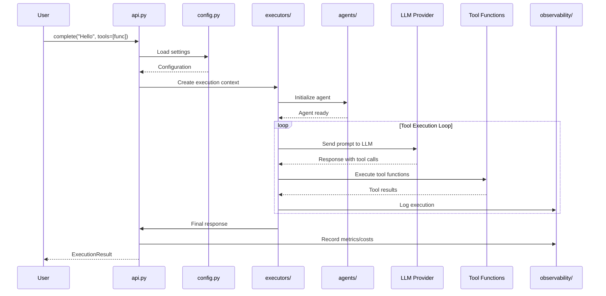
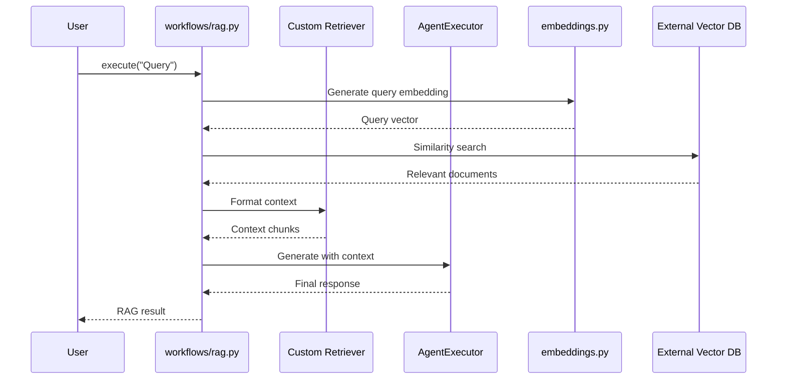
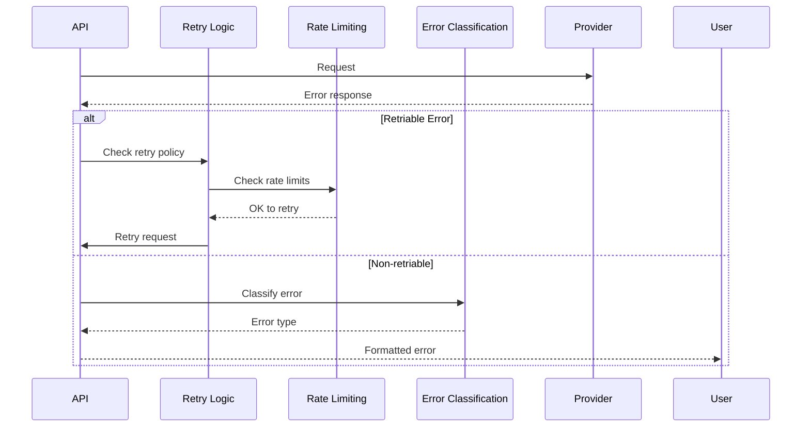
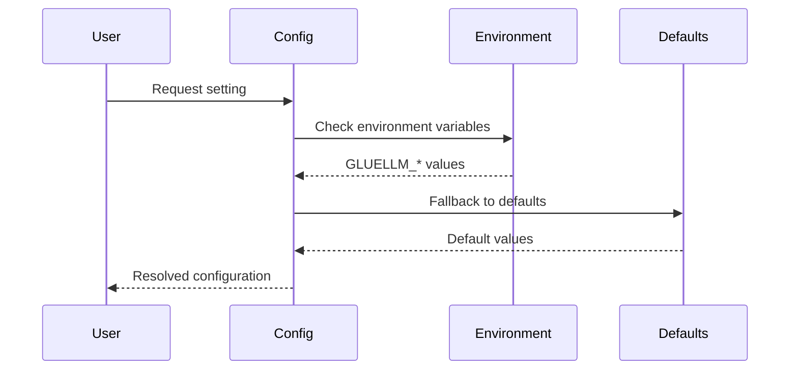

# GlueLLM Request Flow

## Typical Completion Request Sequence



## RAG Workflow Sequence



## Key Flow Patterns

### 1. Simple Completion
```
User → complete() → GlueLLM → Provider → Response
```

### 2. Completion with Tools
```
User → complete() → GlueLLM → Provider → Tool Calls → Tool Execution → Provider → Response
```

### 3. Agent-Based Execution
```
User → AgentExecutor → Agent → GlueLLM → Provider → Tools → Response
```

### 4. Workflow Execution
```
User → Workflow → Multiple Agents → Executors → Providers → Coordinated Response
```

### 5. Batch Processing
```
User → BatchProcessor → Concurrent Executors → Rate Limiting → Results
```

## Error Handling Flow



## Configuration Flow



## Observability Flow

```mermaid
sequenceDiagram
    participant Component
    participant Hooks as Hook System
    participant Logger as Logging
    participant Telemetry as Telemetry
    participant Storage as Eval Storage

    Component->>Hooks: Pre-execution hook
    Hooks-->>Component: Continue
    Component->>Logger: Log operation start
    Component->>Component: Execute operation
    Component->>Telemetry: Record metrics
    Component->>Storage: Store evaluation data
    Component->>Hooks: Post-execution hook
    Component->>Logger: Log completion
```</content>
<parameter name="filePath">/Users/shashwatsingh/Documents/glue-llm/REQUEST_FLOWS.md